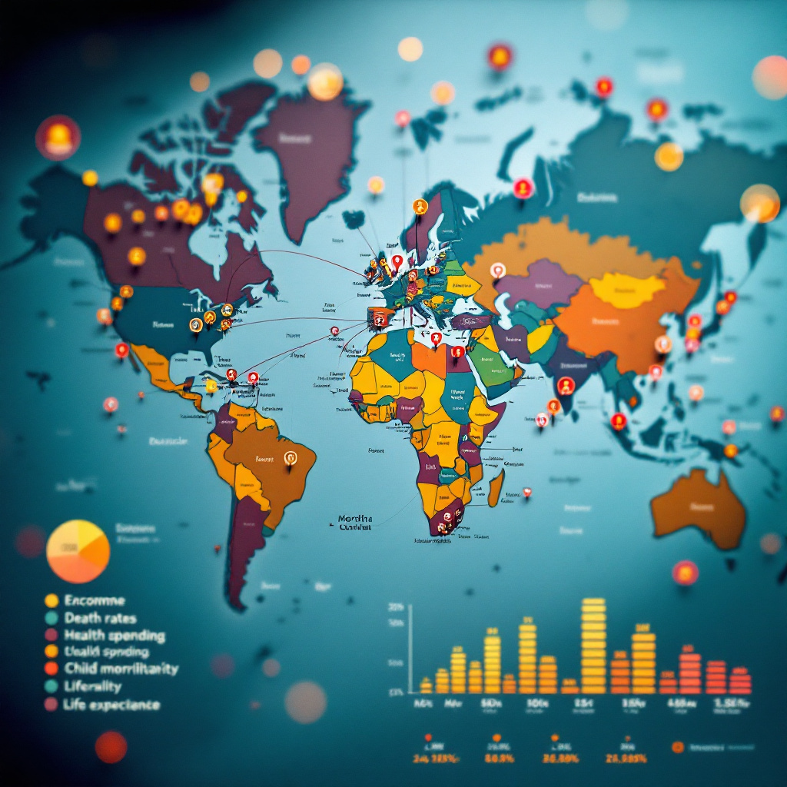

### **Project Proposal: Clustering Countries for Humanitarian Aid Prioritization**

---

#### **Introduction:**
The purpose of this project is to utilize unsupervised learning techniques to categorize countries based on socio-economic and health-related factors. The goal is to help **HELP International**, a humanitarian NGO, prioritize countries that need aid the most. By applying clustering methods like **K-Means** combined with **PCA (Principal Component Analysis)** for dimensionality reduction, we aim to identify countries with similar characteristics and propose the most strategic allocation of the $10$ $ million raised by the NGO.

---

#### **Project Objective:**
The objectives of this project are:
- To categorize countries based on socio-economic and health factors, such as child mortality, income, health expenditure, inflation, etc.
- To use **K-Means clustering** to identify clusters of countries that share similar needs for aid.
- To provide **HELP International** with insights on which clusters of countries should receive priority for aid.

---

#### **Dataset:**
The dataset used in this project contains information about $167$ countries with $10$ variables:

- **Country:** Name of the country (not numeric).
- **Child Mortality (child_mort):** Mortality rate of children under 5 years old.
- **Exports (exports):** Total value of exports.
- **Health (health):** Percentage of GDP spent on health.
- **Imports (imports):** Total value of imports.
- **Income (income):** Gross income per capita.
- **Inflation (inflation):** Inflation rate.
- **Life Expectancy (life_expec):** Average life expectancy of the population.
- **Total Fertility Rate (total_fer):** Average number of children born to a woman during her lifetime.
- **GDP per Capita (gdpp):** Gross Domestic Product per capita.

---

#### **Methodology:**

1. **Stage 1: Data Exploration (Exploratory Data Analysis - EDA):**
   - Visualize the distribution of the data using histograms, box plots, and correlation matrices to understand the underlying relationships between the variables.
   - Check for outliers using box plots and scatter plots. Outliers will be handled in the preprocessing stage.
   - Analyze correlations between the socio-economic and health features to see if any strong relationships exist (e.g., between income and life expectancy).

   **Key Visualizations:**
   - **Histograms:** To view the distribution of each feature (e.g., income, child mortality, etc.).
   - **Box Plots:** To identify outliers in features like child mortality, GDP, and health expenditure.
   - **Correlation Matrix:** To understand relationships between features, especially for identifying potential clusters.

2. **Stage 2: Data Preprocessing:**
   - **Handling Outliers:**
     - Outliers will be identified using box plots and treated by either removing or capping the values (based on domain knowledge).
   - **Scaling the Data:**
     - Since **K-Means** is sensitive to the scale of the data, we will **standardize** the data using **StandardScaler** to normalize each feature (mean = 0, standard deviation = 1).
   - **Encoding:**
     - The dataset contains a **categorical variable (Country)**, which will not be included in the clustering model. This variable will be removed from the dataset.

3. **Stage 3: Clustering (K-Means Algorithm):**
   - **Choosing the Number of Clusters (K):**
     - We will use the **Elbow Method** and **Silhouette Score** to determine the optimal number of clusters.
     - **Elbow Method:** Involves plotting the within-cluster sum of squares (WCSS) for different values of K and identifying the "elbow" point where the improvement in WCSS starts to slow down.
     - **Silhouette Score:** A measure of how similar an object is to its own cluster compared to other clusters. A higher score indicates a better clustering result.
   - **K-Means Algorithm:**
     - The **K-Means** algorithm will be applied to the preprocessed data to group countries into distinct clusters.
     - After clustering, the countries will be assigned to one of the identified clusters.

4. **Stage 4: Dimensionality Reduction (PCA):**
   - To visualize the clusters in a lower-dimensional space, **Principal Component Analysis (PCA)** will be used to reduce the data to two or three dimensions.
   - The first two principal components will capture the most variance in the data, making it easier to visualize and interpret the clusters.

5. **Stage 5: Post-Clustering Analysis:**
   - **Cluster Profiling:** After clustering, we will analyze the centroids of each cluster to understand the main characteristics of countries in each group. For example:
     - Cluster 1: Countries with low income and high child mortality.
     - Cluster 2: Countries with high health expenditure and life expectancy.
     - Cluster 3: Countries with high GDP per capita but lower health expenditure.
   - **Actionable Insights:** Based on the characteristics of each cluster, recommendations will be made to **HELP International** about which clusters need the most aid.

---

#### **Proposed Models and Techniques:**

- **K-Means Clustering:** This unsupervised algorithm will be used to identify clusters of countries based on socio-economic and health features.
- **Principal Component Analysis (PCA):** This will be used to reduce the dimensionality of the data and visualize the clusters in a 2D space.
- **Elbow Method and Silhouette Score:** These methods will help determine the optimal number of clusters (K) to use with **K-Means**.

---

#### **Tools and Technologies:**
- **Programming Language:** Python
- **Libraries Used:**
  - **Pandas** for data manipulation.
  - **NumPy** for numerical operations.
  - **Matplotlib** and **Seaborn** for visualizations.
  - **Scikit-learn** for machine learning models (K-Means, PCA, StandardScaler).
- **Machine Learning Techniques:** **Unsupervised Learning**, **Clustering**, **Dimensionality Reduction (PCA)**.

---

#### **Expected Outcomes:**
- **Clustered Countries:** Countries will be grouped into clusters with similar socio-economic and health characteristics.
- **Actionable Insights for Aid Distribution:** Based on the clusters, we will provide **HELP International** with recommendations on which countries need urgent aid.
- **Visualizations:** Clear, interpretable visualizations (e.g., PCA plots, cluster profiles) will be provided to the CEO of **HELP International** to help make informed decisions on aid allocation.

---

#### **Challenges:**
- **Determining the Number of Clusters (K):** Selecting the optimal number of clusters might be challenging and require careful evaluation of different metrics like the **Elbow Method** and **Silhouette Score**.
- **Interpreting the Clusters:** After clustering, it may be difficult to interpret the characteristics of each cluster without domain knowledge, especially since this is an unsupervised approach.

---

#### **Conclusion:**
This project will leverage unsupervised learning techniques, specifically **K-Means clustering**, to categorize countries based on their socio-economic and health factors. By identifying countries that share similar characteristics, **HELP International** will be able to allocate its resources more effectively and focus on the countries with the greatest needs. This data-driven approach will not only help prioritize aid distribution but also provide valuable insights into the factors that drive the development of nations.

---
